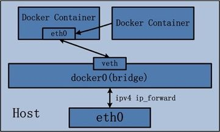

# Resource
[Kubernetes' documentation](https://kubernetes.io/docs/concepts/overview/what-is-kubernetes/)    
[YouTube Video: Understanding Kubernetes Networking. Part 1: Container Networking](https://www.youtube.com/watch?v=B6FsWNUnRo0)    
[Docker Networking](https://zhuanlan.zhihu.com/p/82735394)

# General Concepts
### OS
+ Difference between **Operating system(OS)** and **Kernel**:
   - **Operating system(OS)** 
      * Def: system program that runs on the computer to provide an interface to the computer user so that they can easily operate on the computer
      * The package of data and software that manages the resources of the system
      * In addition to the responsibilities of Kernel, OS is also responsible for **protection and security of the computer**
   - **Kernel**
      * Def: a system program that controls all programs running on the computer
      * The important program in the OS
      * **A bridge between software and hardware of the system**

### Container
Container is just a **process** on the machine uses **namespaces** and **control groups (cgroup)** to provide isolation  

+ Difference between **namespaces** and **control groups (cgroup)**:
   - **namespaces**
      * Def: a feature of the Linux kernel that partitions kernel resources such that one set of processes **sees** one set of resources while another set of processes sees a different set of resources
      * Limits **what you can see**
   - **control groups (cgroup)**
      * Def: a Linux kernel feature that limits, accounts for, and isolates the **resource usage** (CPU, memory, disk I/O, network, and so on) of a collection of processes
      * Limits **how much you can use**

### Network
+ **Protocol**: a set of rules for data transm ission which are agreed by sender and receiver
+ TCP/IP is th e dominant protocol suite for Internet usage.

 

  

### Docker Networking
**Container Network Model** (CNM)

In `Docker`, we have to use IP address and port to access application
- Port mapping & IP address
   + Pot mapping   
      If want to expose port outside container to the host   
         `docker run --rm -it --name [container_name] -p 9393:8181 [image_name]`   
         Maps container's port 8181 to host's port 9393, so now we can reach it through host    
         Without port mapping, it's only listening on the container IP address and own network namespace
   + Get IP address: `curl [IP_address]:8181`  

#### Bridge Network
Unique Network namespace for each container

It attaches container to bridge (link layer)    
By default, when install Docker, all conatiners have link back to host   
`docker0` bridge is in the host network namespace     
=> Can move traffic in & out of the host to container

Look inside container, interface `eth0` (part of veth peer)

**veth peer** in Linux is a link between two namespaces. Like physical layer surface
- `brctl show docker0`
- `ip link show`   
   Show the veth interface on the host

#### Host Network
Same Network namespace for container with host, remove network isolation between container and host   
=> Same IP address

When run container, share its namespace of host with it      
`docker run --network=host`     
Use it when want to change network of host

#### none
Disable all networking for containers   
`docker run --network=none`    
Use it in conjunction with a custom network

### Kubernetes Networking

#### Pod Network
Each Pod has a unique IP address
IP address reachable from all other Pods in the K8s cluster

- Problems of Port Mapping     
   :thumbsdown: *Conflicts* when both application/container map to same port on host machine
   => Don't know which port is free on host right now

- Pod abstraction    
   Abstraction over containers (create *running environment or a layer* on top of containers)     
   Can have one or more containers    
   
   + Like small machine with its own IP address/network namespace
   + Virtual ethernet connection to connect to the underlying infrastructure network
   + Like a **Host** has IP address and a range of ports that can allocate containers

   => **Different Pod** with **diffrent IP addresses/network namespace** as **contained isolated virtual Host** machine    
   => No port conflict

##### Joined-container
An extension way of Host Network    
Used by K8s' Pod

All containers inside the same Pod share the same Pod network namespace (1 interface called eth0 by default)
  

#### Node Network

#### Cluster Network
